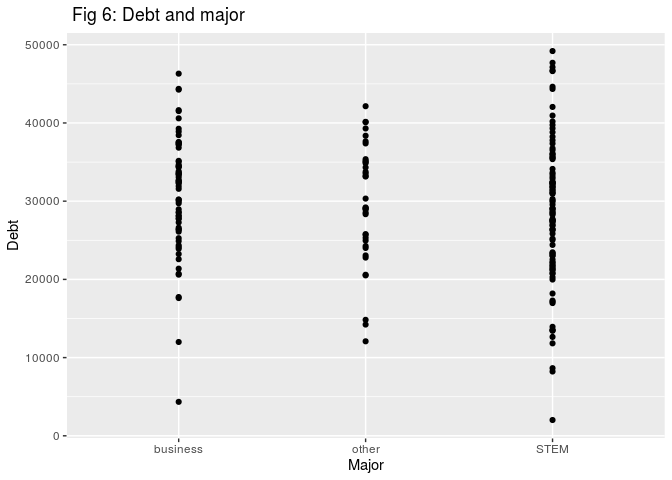

Loading all the necessary libraries. options(warn = -1) will not show warning in the output. SuppressMessages function will suppress the messages for loading libraries.


```r
options(warn = -1)
suppressMessages(library(tidyverse))
suppressMessages(library(broom))
suppressMessages(library(modelr))
suppressMessages(library(rje))
suppressMessages(library(ggfortify)) #helps to show all the residual vs fitted plot, normality plot
```


Loading the datasets of allendale student


```r
allendale_students <- read_csv("data/allendale-students.csv")
```

```
## Parsed with column specification:
## cols(
##   distance = col_double(),
##   scholarship = col_double(),
##   parents = col_double(),
##   car = col_double(),
##   housing = col_character(),
##   major = col_character(),
##   debt = col_double()
## )
```


Using glimpse function to inspect most of the column name in the datasets.


```r
glimpse(allendale_students)
```

```
## Observations: 200
## Variables: 7
## $ distance    <dbl> 40, 30, 130, 120, 30, 0, 30, 50, 10, 10, 40, 140, 40…
## $ scholarship <dbl> 1532, 7479, 2664, 1998, 1462, 3053, 1301, 1948, 2295…
## $ parents     <dbl> 0.440, 0.265, 0.115, 0.325, 0.105, 0.335, 0.375, 0.1…
## $ car         <dbl> 6, 7, 3, 9, 10, 9, 5, 6, 8, 3, 8, 8, 10, 8, 6, 4, 7,…
## $ housing     <chr> "off campus", "on campus", "on campus", "on campus",…
## $ major       <chr> "STEM", "STEM", "business", "business", "other", "ST…
## $ debt        <dbl> 26389, 21268, 32312, 28539, 34867, 18193, 29990, 343…
```


**Exploratory Analysis:**

`Debt` is our response variable. The predictor (or independent) variable for our linear regression with response variable in the datasets is plotted using `geom_smooth`. This helps to visualize the pattern of the datasets.

+ Scatter plot like Debt and Distance, Parents and Debt have shightly different range. However, there are no outrageous variations in the dataset which makes it difficult to understand their pattern. So I opt for not using any kind of transformation. Although, we chould use log get the similar range for x and y axis. In this datasets, the pattern is very clear to understand.


```r
ggplot(allendale_students, aes(distance, debt)) +
  geom_point() + geom_smooth()+ ggtitle("Fig 1: Debt and Distance")+ xlab("Distance") + ylab("Debt")
```

```
## `geom_smooth()` using method = 'loess' and formula 'y ~ x'
```

<!-- -->

+ As the distance increases the debt also increases. This shows a positive linear regression line.


```r
ggplot(allendale_students, aes(scholarship, debt)) +
  geom_point() + geom_smooth()+ ggtitle(" Fig 2: Debt and scholarship")+ xlab("scholarship") + ylab("Debt")
```

```
## `geom_smooth()` using method = 'loess' and formula 'y ~ x'
```

<!-- -->


+ The graph above is Debt and Scholarship. This is obivious that, if a student has a scholarhsips, the debt will going down which is shown in the graph. When the scholarship amount increases from 1000 to 2000 the point shows lower in debt. But there is one value on the right most end, which might be an outlier as this shows if we have scholarship above 2000, there is stil people who is going to have some debt remaining which could be as there are other determining factors.


```r
ggplot(allendale_students, aes(parents, debt)) +
  geom_point() + geom_smooth()+ ggtitle("Fig 3: Debt and parents")+ xlab("parents") + ylab("Debt")
```

```
## `geom_smooth()` using method = 'loess' and formula 'y ~ x'
```

<!-- -->

+ The graph above is Parents and Debt. Here, there is much variation in the data points. The graph says, if parents is paying the half cost, then the debt is goining to decrease.


```r
ggplot(allendale_students, aes(car, debt)) +
  geom_point() + geom_smooth()+ ggtitle("Fig 4: Debt and car")+ xlab("Car") + ylab("Debt")
```

```
## `geom_smooth()` using method = 'loess' and formula 'y ~ x'
```

<!-- -->

+ The above graphs shows the relationship between Debt and Car's age. The line here is in horizontal axis, meaning there is not much difference and the number of year increases the debt is still similar. 


```r
ggplot(allendale_students, aes(housing, debt)) +
  geom_point() + geom_smooth()+ ggtitle(" Fig 5: Debt and Housing")+ xlab("Housing") + ylab("Debt")
```

```
## `geom_smooth()` using method = 'loess' and formula 'y ~ x'
```

<!-- -->

+ The above graphs shows Debt and Housing relationship. Because the housing is categorical variables here, we can see two different line instead of scattered plots in the graphs. In the off campus and on campus, the people who live on and off campus have similar debt values. We noticed on campus people have more debt to pay with minimum around 1000 in the start. 


```r
ggplot(allendale_students, aes(major, debt)) +
  geom_point() + geom_smooth()+ ggtitle(" Fig 6: Debt and major")+ xlab("Major") + ylab("Debt")
```

```
## `geom_smooth()` using method = 'loess' and formula 'y ~ x'
```

<!-- -->

+ The above graphs shows Debt and Major relationship. Here, Major is categorical variables, thus this shows three lines. In the graph, the major under STEM, has higher debt ratio compare to rest two and the lowest is major other. 


**Creating an Indicator variable for categorical values**

+ Using dummy variable as indicating the categorical values for housing and major. I have used 1 for values occured in the variable 0 for other.  A dummy column is one which has a value of one when a categorical event occurs and a zero when it doesn’t occur.

+ For housing (off campus and on campus) 1 as the dummy variable where present and 0 for on campus and vice versa. Similar is the case for major variables as 1 if there is Steam present in a values for major column. I also separated it into different columns indicating there presence in each column by 1. Lastly, I choose only the necessary columns as we will be playing with these variables in the analysis from here with separate name as `allen_data`. 


```r
allendale_students %>%
  mutate(off_campus= allendale_students$housing<- ifelse(allendale_students$housing =="off campus", 1, 0)) %>%
  mutate(on_campus= allendale_students$housing<- ifelse(allendale_students$housing =="on campus", 1, 0)) %>%
mutate(major_stem= allendale_students$major<- ifelse(allendale_students$major =="STEM", 1, 0)) %>%
mutate(major_business= allendale_students$major<- ifelse(allendale_students$major =="business", 1, 0))%>%
  mutate(major_other= allendale_students$major<- ifelse(allendale_students$major =="other", 1, 0)) -> allendale_students
head(allendale_students)
```

```
## # A tibble: 6 x 12
##   distance scholarship parents   car housing major  debt off_campus
##      <dbl>       <dbl>   <dbl> <dbl> <chr>   <chr> <dbl>      <dbl>
## 1       40        1532   0.44      6 off ca… STEM  26389          1
## 2       30        7479   0.265     7 on cam… STEM  21268          0
## 3      130        2664   0.115     3 on cam… busi… 32312          0
## 4      120        1998   0.325     9 on cam… busi… 28539          0
## 5       30        1462   0.105    10 off ca… other 34867          1
## 6        0        3053   0.335     9 off ca… STEM  18193          1
## # … with 4 more variables: on_campus <dbl>, major_stem <dbl>,
## #   major_business <dbl>, major_other <dbl>
```

```r
keeps <- c("distance", "scholarship", "parents", "car", "major_stem", "major_business","major_other", "on_campus","off_campus", "debt")
allen_data<-allendale_students[keeps]
dplyr::tbl_df(allen_data)
```

```
## # A tibble: 200 x 10
##    distance scholarship parents   car major_stem major_business major_other
##       <dbl>       <dbl>   <dbl> <dbl>      <dbl>          <dbl>       <dbl>
##  1       40        1532   0.44      6          1              0           0
##  2       30        7479   0.265     7          1              0           0
##  3      130        2664   0.115     3          0              1           0
##  4      120        1998   0.325     9          0              1           0
##  5       30        1462   0.105    10          0              0           1
##  6        0        3053   0.335     9          1              0           0
##  7       30        1301   0.375     5          0              1           0
##  8       50        1948   0.185     6          0              1           0
##  9       10        2295   0.225     8          1              0           0
## 10       10        4653   0.185     3          1              0           0
## # … with 190 more rows, and 3 more variables: on_campus <dbl>,
## #   off_campus <dbl>, debt <dbl>
```

**PowerSet**

Using Powersets, which will give all possible submodels for all 9 variables. I dont want response variable for creating a formula of submodel so I minus debt and selected all the column names of the allen_data. These gives me all the subsets for our predictor variables. The total number was 512 number of rows and I deleted the character whose value is 0. This means there is no any predictor variables in the analysis making it total to 511 number of rows.


```r
allen_data %>% 
  select(-debt) %>% 
  names %>% 
  powerSet()->predictors

predictors[lapply(predictors,length)>0]->predictors
head(predictors)
```

```
## [[1]]
## [1] "distance"
## 
## [[2]]
## [1] "scholarship"
## 
## [[3]]
## [1] "distance"    "scholarship"
## 
## [[4]]
## [1] "parents"
## 
## [[5]]
## [1] "distance" "parents" 
## 
## [[6]]
## [1] "scholarship" "parents"
```

**Writing a Function**

+ Options(scipen=4) function as global function will convert the values in the dataframe into scientific notation after 4 decimal point. The first steps is to create the formula from the string. 

+ The argument here is x, and predictors which is all the submodels from the above functions. I collapse them using `+` and stored it into pdat. I created a formula where I used glance function to get all the values in a table. Glance function will give all the intercept values and tidy will give the residual values in the model. 

+ Thus, I used spread to get all the intercept values for the explanatory variables. For the tidy function I wanted r square value, adjusted r square, dataframe, formula, so I combined these column using cbind.

+ In the function, debt being the response variable and used the formula by pasting debt~ for all the subsets. I used lapply and  rbind_list function to combine all the separate dataframe into one. The new dataframe we have shows all the subsets values along with the formula used, response, intercept, slope for all the variables along with adjusted R square and residual values. The total number of rows is equivalent to `2^n-1` (511) in this case. 


```r
options(scipen=4)

lapply(predictors, function(x)
  {
  paste(x, collapse = '+')-> pdat
  lm(as.formula(paste('debt ~',pdat)), data=allen_data) %>%
  glance() %>% 
  mutate("response_variable" = 'debt', formula= (paste('debt~', pdat)))-> model_glance
  paste(x, collapse = '+')-> pdat
  lm(as.formula(paste('debt ~',pdat)), data=allen_data) %>% tidy() %>% spread(term, estimate) %>%
  mutate("response_variable" = 'debt', formula= (paste('debt~', pdat))) %>% cbind(model_glance[,c("r.squared","adj.r.squared","df","formula")])
}) %>% rbind_list()  %>% arrange(formula) -> model_intercept
  coalesce_by_column <- function(model_intercept) {
  return(coalesce(model_intercept[1], model_intercept[2]))}
  model_intercept %>%
  group_by(formula) %>%
  summarise_all(coalesce_by_column)%>%
  tibble::rowid_to_column( "Model Number")-> final_model
head(final_model)
```

```
## # A tibble: 6 x 19
##   `Model Number` formula std.error statistic p.value `(Intercept)` distance
##            <int> <chr>       <dbl>     <dbl>   <dbl>         <dbl>    <dbl>
## 1              1 debt~ …      298.   -0.0384   0.969        29554.       NA
## 2              2 debt~ …      299.   -0.233    0.816           NA        NA
## 3              3 debt~ …      300.   -0.223    0.824           NA        NA
## 4              4 debt~ …      299.   -0.211    0.833           NA        NA
## 5              5 debt~ …      299.   -0.211    0.833           NA        NA
## 6              6 debt~ …      299.   -0.211    0.833           NA        NA
## # … with 12 more variables: response_variable <chr>, r.squared <dbl>,
## #   adj.r.squared <dbl>, df <int>, scholarship <dbl>, parents <dbl>,
## #   car <dbl>, major_stem <dbl>, major_business <dbl>, major_other <dbl>,
## #   on_campus <dbl>, off_campus <dbl>
```

**Choosing the best model**

+ In order to check the model, I used significant gain in the model meaning I compare change in the r square value as delta and got the change into separated column called Diff. I sorted based on highest R square value and among them, there were several factors that was considered like nuber of data frame, P values, adjusted R square value and R Square values itself. Under those, the combination of those made up the most significant adjusted R square value, i.e 0.7427 for Model Number 225 with 3 explanatory variables. 

+ Delta means the change or bump after adding each to existing values. There is less overlapping meaning less colinearity. Thus, It is very clear that this is our best model. 

+ Thus, the best model with the highest Adjusted R square values is 225, there are 3 predictor variables. The Adjusted R square value is : `0.7427` and R square value is `0.7466`.

+ The model equation is `debt ~ distance -scholarship + parents`.


```r
suppressMessages(library(data.table))
DT <- data.table(final_model)
DT[ ,list(`Model Number`,df, p.value, r.squared, adj.r.squared, Diff=diff(r.squared))  ] %>%
  arrange(desc(Diff)) -> model_check
head(model_check)
```

```
##   Model Number df      p.value   r.squared adj.r.squared      Diff
## 1          383  3 1.517970e-01 0.149888137  0.1412575597 0.2635139
## 2          160  4 2.511871e-14 0.368382552  0.3587149383 0.2465671
## 3           32  3 9.827729e-01 0.009773765 -0.0002792932 0.2383260
## 4          447  3 9.636718e-25 0.421025911  0.4151480019 0.1453590
## 5          319  2 2.080280e-91 0.009771416  0.0047702610 0.1311836
## 6          224  4 2.450381e-30 0.615989338  0.6101116237 0.1306189
```

```r
 final_model %>%
    arrange(desc(adj.r.squared)) %>%
    slice(49)-> bestmodel
bestmodel
```

```
## # A tibble: 1 x 19
##   `Model Number` formula std.error statistic  p.value `(Intercept)`
##            <int> <chr>       <dbl>     <dbl>    <dbl>         <dbl>
## 1            225 debt~ …    0.0901     -17.1 8.04e-41            NA
## # … with 13 more variables: distance <dbl>, response_variable <chr>,
## #   r.squared <dbl>, adj.r.squared <dbl>, df <int>, scholarship <dbl>,
## #   parents <dbl>, car <dbl>, major_stem <dbl>, major_business <dbl>,
## #   major_other <dbl>, on_campus <dbl>, off_campus <dbl>
```

Only getting the formula for the best model.


```r
as.vector(bestmodel$formula)
```

```
## [1] "debt~ distance+scholarship+parents"
```


A graph with the r-square ($R^2$) value on the vertical axis vs. the number of explanatory variables in the model on the horizontal axis. Here, in total, there are 9 explanatory variables used in the model.


```r
ggplot(final_model, aes(x= df, y= r.squared, fill= r.squared, label=final_model$`Model Number`))+ geom_line( alpha= 0.1, color="red")+ geom_point() + geom_text(aes(label=ifelse(final_model$`Model Number` == "225", as.character(final_model$`Model Number`),'')),hjust=-0.1,vjust=-0.8)+theme_minimal()+ ggtitle("R Square plot : Model and Explanatory Variables")
```

<!-- -->


Residual Plot For the best model.
Residuals are essentially the difference between the actual observed response values (debt to 3 predictor variables in our case) and the response values that the model predicted.


```r
fit <- lm(debt ~ distance+scholarship+parents, data = allen_data) 
ggplot(fit, aes(x = .fitted, y = .resid)) + geom_point()+geom_smooth()+ggtitle("Residuals Vs Fitted Plot")
```

```
## `geom_smooth()` using method = 'loess' and formula 'y ~ x'
```

<!-- -->


From the above residual plot, for the best model, all the points falls around the horizontal axis straight towards x axis. We can see one outlier point here, points far left top rest everything line up on the horizontal line. It shows homoscedasticity pattern (homogenity of variances) where residual and fitted for this model are uncorelated, but closer look shows slightly heteroscedasticity as variance are more towards lower section of the horizontal line.


**Interaction Term**

If debt is out response variables, and we compare their relation and interation term then,
Focusing on the interation term, between scholarship, housing and parents whereas there are no any interaction between (scholarship and parents) and (off_campus and parents). The slope of the interaction for scholarship:off_Campus is 0.513 which is positive and p value = 0.049, which is slightly less than 0.05 . In order to explore more, lets visualize them,


```r
allen_data$on_campus<- as.factor(allen_data$on_campus)
allen_data$off_campus<- as.factor(allen_data$off_campus)

model3 <- lm(debt~(scholarship + on_campus + off_campus+ parents)^2, data = allen_data)
tidy(model3)
```

```
## # A tibble: 7 x 5
##   term                     estimate std.error statistic  p.value
##   <chr>                       <dbl>     <dbl>     <dbl>    <dbl>
## 1 (Intercept)             41926.     1588.       26.4   5.66e-66
## 2 scholarship                -1.72      0.305    -5.64  6.07e- 8
## 3 on_campus1               4047.     2035.        1.99  4.82e- 2
## 4 parents                -27580.     4915.       -5.61  6.91e- 8
## 5 scholarship:on_campus1     -0.513     0.259    -1.98  4.93e- 2
## 6 scholarship:parents         0.964     0.864     1.12  2.66e- 1
## 7 on_campus1:parents      -2138.     5850.       -0.365 7.15e- 1
```

```r
glance(model3)
```

```
## # A tibble: 1 x 11
##   r.squared adj.r.squared sigma statistic  p.value    df logLik   AIC   BIC
##       <dbl>         <dbl> <dbl>     <dbl>    <dbl> <int>  <dbl> <dbl> <dbl>
## 1     0.589         0.576 5522.      46.1 8.68e-35     7 -2004. 4023. 4049.
## # … with 2 more variables: deviance <dbl>, df.residual <int>
```

```r
augment(model3)
```

```
## # A tibble: 200 x 12
##     debt scholarship on_campus off_campus parents .fitted .se.fit  .resid
##    <dbl>       <dbl> <fct>     <fct>        <dbl>   <dbl>   <dbl>   <dbl>
##  1 26389        1532 0         1            0.44   27809.    920.  -1420.
##  2 21268        7479 1         0            0.265  23325.    976.  -2057.
##  3 32312        2664 1         0            0.115  36909.   1000.  -4597.
##  4 28539        1998 1         0            0.325  32484.    768.  -3945.
##  5 34867        1462 0         1            0.105  36666.    939.  -1799.
##  6 18193        3053 0         1            0.335  28428.    576. -10235.
##  7 29990        1301 0         1            0.375  29819.    761.    171.
##  8 34333        1948 0         1            0.185  33825.    676.    508.
##  9 27717        2295 1         0            0.225  34665.    723.  -6948.
## 10 21398        4653 0         1            0.185  29660.    604.  -8262.
## # … with 190 more rows, and 4 more variables: .hat <dbl>, .sigma <dbl>,
## #   .cooksd <dbl>, .std.resid <dbl>
```


+ Visualizing all two interaction term below. 

+ The first two graph shows the interaction between housing and scholarship. There is no any different either for on campus or off campus housing. The first graph shows the interaction between scholarship and housing students.

+ The curve geom_smooth produces is indeed an estimate of the conditional mean function, i.e. it's an estimate of the mean scholarships conditional on the factor on campus and off campus.(it's a particular kind of estimator called LOESS). The number we calculate, in contrast, is an estimate for the unconditional mean, i.e. the mean over all the data. The lines shows there is an interaction term so does the summary table from the linear model.

+ The graphs below shows housing and scholarship have interaction term as the line intersects each other. The significance is also shown by the P value, if its higher or lower to 0.5.


+ For second graph for parents and Scholarship, Its hard to actually find out any pattern because both of them are continous variable. Thus, when I create then into factor variables, we can see some interaction between scholarship and parents in the summary table and in the graph as well.


```r
ggplot(data=model3, aes(x=scholarship,y=debt, color=on_campus)) + geom_point()+ geom_smooth()+labs(x = "scholarships",  y = "debt")+ggtitle("Interaction Plot for Scholarship and On campus")
```

```
## `geom_smooth()` using method = 'loess' and formula 'y ~ x'
```

<!-- -->

```r
ggplot(data=model3, aes(x=scholarship,y=debt, color=off_campus)) + geom_point()+ geom_smooth()+labs(x = "scholarships",  y = "debt")+ggtitle("Interaction Plot for Scholarship and Off Campus")
```

```
## `geom_smooth()` using method = 'loess' and formula 'y ~ x'
```

<!-- -->

```r
#For parents and scholarship
ggplot(data=model3, aes(x=scholarship,y=debt, color=parents)) + geom_point()+ geom_smooth()+labs(x = "scholarships",  y = "debt")+ggtitle("Interaction Plot for Scholarship and Parents")
```

```
## `geom_smooth()` using method = 'loess' and formula 'y ~ x'
```

<!-- -->


+ The interaction for parents was not clear as it was continous variables, Thus, I choose to make it into factor and divide the interval into 3 formats. From negative value to 0.2 as one, 0.2 to 0.4 as 2 and 0.4 to above infinity as 3. These values were also named as lower than 0.2, 0.2 to 0.4 and higher than 0.4 respectivily.

+ We run the summary model for this, We can see that, scholarship and parents group higher than 0.4 has interaction term. When We plot this below, We can see there is an interaction term between 0.2 to 0.4 and lower than 0.2. But this varies depending upon the interval we assign for the parents while making them as a factor variables. I am also using geom_smooth inorder to fit the mean value in the linear regression. 


```r
allen_data %>%
mutate(p_group=cut(parents, breaks=c(-Inf, 0.3, 0.4, Inf), labels=c("lower than 0.2","0.2 to 0.4","higher than 0.4")))-> new_data
  model4 <- lm(debt~(scholarship + on_campus + off_campus+ p_group)^2, data = new_data)
tidy(model4)
```

```
## # A tibble: 10 x 5
##    term                               estimate std.error statistic  p.value
##    <chr>                                 <dbl>     <dbl>     <dbl>    <dbl>
##  1 (Intercept)                         3.81e+4  1076.       35.4   1.15e-85
##  2 scholarship                        -1.81e+0     0.226    -8.00  1.22e-13
##  3 on_campus1                          2.15e+3  1519.        1.41  1.59e- 1
##  4 p_group0.2 to 0.4                  -6.90e+3  1798.       -3.84  1.68e- 4
##  5 p_grouphigher than 0.4             -6.97e+3  1830.       -3.81  1.88e- 4
##  6 scholarship:on_campus1             -1.40e-1     0.274    -0.510 6.11e- 1
##  7 scholarship:p_group0.2 to 0.4       7.98e-1     0.288     2.77  6.10e- 3
##  8 scholarship:p_grouphigher than 0…  -6.38e-2     0.341    -0.187 8.52e- 1
##  9 on_campus1:p_group0.2 to 0.4        8.22e+2  1998.        0.411 6.81e- 1
## 10 on_campus1:p_grouphigher than 0.4  -6.21e+2  2198.       -0.282 7.78e- 1
```

```r
glance(model4)
```

```
## # A tibble: 1 x 11
##   r.squared adj.r.squared sigma statistic  p.value    df logLik   AIC   BIC
##       <dbl>         <dbl> <dbl>     <dbl>    <dbl> <int>  <dbl> <dbl> <dbl>
## 1     0.569         0.548 5703.      27.8 2.26e-30    10 -2008. 4039. 4075.
## # … with 2 more variables: deviance <dbl>, df.residual <int>
```

```r
augment(model4)
```

```
## # A tibble: 200 x 12
##     debt scholarship on_campus off_campus p_group .fitted .se.fit  .resid
##    <dbl>       <dbl> <fct>     <fct>      <fct>     <dbl>   <dbl>   <dbl>
##  1 26389        1532 0         1          higher…  28302.   1319. -1913. 
##  2 21268        7479 1         0          lower …  25706.   1173. -4438. 
##  3 32312        2664 1         0          lower …  35097.    913. -2785. 
##  4 28539        1998 1         0          0.2 to…  31912.   1271. -3373. 
##  5 34867        1462 0         1          lower …  35496.    850.  -629. 
##  6 18193        3053 0         1          0.2 to…  28152.   1180. -9959. 
##  7 29990        1301 0         1          0.2 to…  29926.   1334.    64.4
##  8 34333        1948 0         1          lower …  34616.    791.  -283. 
##  9 27717        2295 1         0          lower …  35816.    941. -8099. 
## 10 21398        4653 0         1          lower …  29718.    729. -8320. 
## # … with 190 more rows, and 4 more variables: .hat <dbl>, .sigma <dbl>,
## #   .cooksd <dbl>, .std.resid <dbl>
```

```r
ggplot(data=model4, aes(x=scholarship,y=debt, color=p_group)) + geom_point()+ geom_smooth()+labs(x = "scholarships",  y = "debt")+ ggtitle("Interaction term between Scholarship and Parents")
```

```
## `geom_smooth()` using method = 'loess' and formula 'y ~ x'
```

<!-- -->

